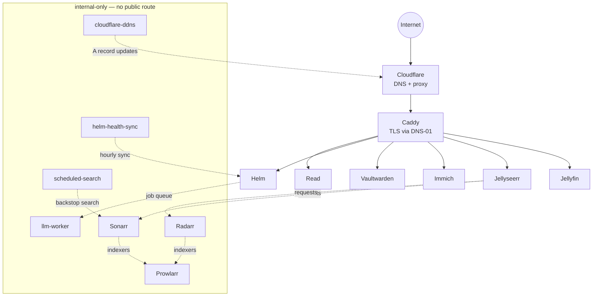

# lionel.place

The self-hosted stack behind [lionel.place](https://lionel.place): media streaming, photo
management, a password manager, an editorial blog, and **Helm** — a custom AI-integrated
health console. One home server, orchestrated with Docker Compose, with Caddy and
Cloudflare handling TLS and DNS in front of it.

## Architecture



## Routing

Caddy terminates TLS for every subdomain and reverse-proxies to the container behind it:

| Hostname | Service |
|---|---|
| `lionel.place` | Static landing page |
| `stream.` / `jellyfin.` / `pirateship.lionel.place` | Jellyfin |
| `requests.` / `jellyseerr.lionel.place` | Jellyseerr |
| `immich.lionel.place` | Immich |
| `helm.lionel.place` | Helm |
| `recipes.lionel.place` | Helm — public, read-only recipe bank |
| `vault.lionel.place` | Vaultwarden |
| `read.lionel.place` | Read (editorial blog) |
| `resume.lionel.place` | Static résumé page |

## Helm — AI health console

Helm is the centerpiece of this repo: a full-stack health and productivity tracker built
for daily use. FastAPI + SQLAlchemy on the backend, React + TypeScript + Vite on the
frontend, built into a single SPA.

**Auth.** JWT sessions backed by Jellyfin — log in with your Jellyfin account rather than
a separate credential store. Two roles: `admin` (full access) and `friend` (scoped to
recipes and the shopping list, so housemates can use the cooking half without touching
health data).

**Natural-language logging.** Meals and workouts are typed in plain English and parsed
into structured records — macros, sets/reps, everything downstream code expects as clean
data.

**A durable job queue for every LLM call.** Parsing, chat, recipe import, and research all
enqueue onto an `llm_jobs` table (SQLite) instead of running inline. A separate
`llm-worker` container claims jobs, executes them — Claude by default, Gemini as an
opt-in fallback and for multimodal input — and posts results back over an internal HTTP
API. The frontend reconnects to any in-flight job from any view: fire a request from the
dashboard, navigate away, come back, and the result is waiting. Full design in
[docs/llm_routing.md](docs/llm_routing.md).

**Health data.** Google Health ingestion with session de-duplication (Google reports the
same workout twice, once with calories and once without — Helm keeps the richer copy).
TDEE is modeled both formula-based (Mifflin-St Jeor) and CICO-derived from logged data,
feeding weight projections.

**Phases.** Cut/bulk/maintenance planning with scheduled refeeds and day-of-phase
progress.

**Cooking, shared.** A recipe bank (photos, ratings, scaling, tag filters) and a shopping
list, both shared with `friend`-role users — the same recipe data exposed read-only at
`recipes.lionel.place` — plus a configurable custom-habit tracker whose
label/emoji/unit/parser-synonyms come from env.

## Read — editorial blog

A hand-written-HTML blog at `read.lionel.place` — no CMS, no React. Authors wrap
sensitive paragraphs in `<private password="..." hint="...">` tags; a build step encrypts
them with AES-GCM (PBKDF2-SHA256 key derivation) and ships only ciphertext. A client-side
script finds locked blocks, prompts for the password, and decrypts in the browser — the
server never sees the plaintext or the password. A thin FastAPI backend serves the static
pages plus one live endpoint: email subscription.

## Run it

```bash
git clone https://github.com/LionelEisenberg/lionels-place
cd lionels-place
cp .env.example .env
cp helm/.env.example helm/.env
cp read/.env.example read/.env
cp immich/.env.example immich/.env
# fill in every value — each file's comments say where it comes from
docker compose up -d                      # core stack
docker compose --profile immich up -d     # + photos
```

For a full rebuild from a dead machine — restoring data, adjusting host paths, and
verifying each service — see [`RESTORE.md`](./RESTORE.md).

---

This repo is a filtered, fresh-history export of a private working repository — no data,
secrets, or personal history ship here.
